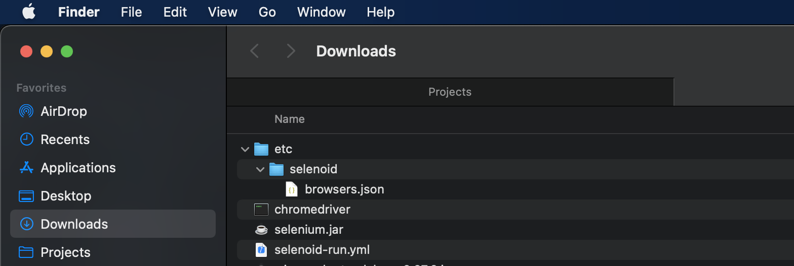

# Selenide-Based Project Template
This project consists of 2 main branches: _allure_integration_ and _report_portal_integration_. The branch _report_portal_integration_ is also a _master_.

## Core libraries:
* REST Assured
* Selenide
* TestNG
* Cucumber 4
* Log4j2

## Basic Configuration
Basic parameters are in _src/main/resources/config.properties_

## Reporting
As you may noticed you have 2 options here: **Allure** and **ReportPortal**

### Allure Reporting
Allure reporting implemented through native Allure listener that allows to add all the needed steps and screenshots in following way:
```
SelenideLogger.addListener("AllureSelenide", new AllureSelenide().enableLogs(LogType.DRIVER, Level.ALL));
SelenideLogger.addListener("AllureSelenide", new AllureSelenide().screenshots(true).savePageSource(false));
```

That means we can see the steps of Selenide wrapped into Cucumber steps with attached screenshots and stacktrace in case of test failure.

Used dependencies:
```
        <dependency>
            <groupId>io.qameta.allure</groupId>
            <artifactId>allure-java-commons</artifactId>
            <version>${allure.basic.version}</version>
        </dependency>

        <dependency>
            <groupId>io.qameta.allure</groupId>
            <artifactId>allure-cucumber4-jvm</artifactId>
            <version>${allure.basic.version}</version>
        </dependency>

        <dependency>
            <groupId>io.qameta.allure</groupId>
            <artifactId>allure-selenide</artifactId>
            <version>${allure.basic.version}</version>
        </dependency>

        <dependency>
            <groupId>org.aspectj</groupId>
            <artifactId>aspectjweaver</artifactId>
            <version>${aspectj.version}</version>
        </dependency>
```

```
        <allure.basic.version>2.13.1</allure.basic.version>
        <aspectj.version>1.9.5</aspectj.version>
```

The ways you can get pretty Allure Report may vary depending on your needs: 
* Jenkins allure plugin. This plugin as being added as the post build step in your job and attaches the report to the every job run results.
* Allure command line tool installed on your server. This tool can generate report from your _allure-results_ folder in your jenkins job space to any specified _allure-report_ folder on your hard drive. But this way you will get results only for your last test run and will be able to see the .html file through any webserver like nginx. 
    * Make sure your volumes in docker-compose are shared well. Only this way _nginx_ will see what is going on in jenkins workspace folder in **real time**. If you share volures without using _volumes_from_ nginx will see static data in jenkins folder created when junkins container had just started. What you should use:
    ```
    services:
        jenkins:
            volumes:
                - /var/jenkins_home/workspace/allure-report
        
        nginx:
            volumes_from:
                - jenkins:ro
    ```
    * You will need to install _Custom Tools_ plugin for Allure CommandLine execution
    * Go to Global Tool Configuration and add custom tool 
    * Fill _Name_ field
    * Install automatically 
    * _Label_ field leave empty
    * Put _Download URL_ entirely
    * You should set _Subdirectory_ value so that it contains full path to the binary after unzipping. For Allure CommandLine it should be ../allure_2.13.1/bin
    * Then Go to your job configuration to the _Build Environment_ section and choose there _Install Custom Tools_. Only that way your custom tool become available for the job. 
* Building full Allure Report with test run history. This is a little bit tricky way also with limited history size. It includes the previous step, but instead of building _allure-report_ from job run _allure-results_ you will have to copy the contents of this folder to any common _allure-results_ via executing bash script as jenkins job bost build step and only then generate _allure-report_.
    * Install _Post Build Task Plugin_.
    * To copy allure-results folder to the common folder you have to set _OR_ in _Post Build Task_ and execute following command (this command works only for the first time, and after that it can't update directory contents any more):
    ```
    cp -r /var/jenkins_home/workspace/sample_job_2/allure-results /var/jenkins_home/workspace/allure-results
    ```
    * To copy allure-results folder contents to the common folder (this command works only when allure-results folder already exists in destination):
    ```
    cp -p -f -r /var/jenkins_home/workspace/sample_job_2/allure-results/* /var/jenkins_home/workspace/allure-results
    ```
    * And finally execute Allure Command Line command to generate report into any directory you want:
    ```
    allure generate --clean /...path.../allure-results -o /...path.../allure-report
    ```
    * Now you just should specify the root folder for your webserver the same as _/...path.../allure-report_ and if you don't have any issues with volumes sharing in Docker your webserver will show the generated report (after you reload its container, of course `docker container exec container84h4name35342here nginx -s reload`)
* Due to possible performance issues in future I consider an option to update _allure-java-commons_ and _allure-generator_ libraries to support mongoDB. Any help is appreciated.

### Report Portal Reporting
Unlike Allure, RP is a stand alone tool raised on the separate server and collecting data through the sockets into its inbuilt Postgress DB.
 
 The only dependency used for this integration to log cucumber steps:
 
 ```
        <dependency>
            <groupId>com.epam.reportportal</groupId>
            <artifactId>agent-java-cucumber4</artifactId>
            <version>${rp.cucumber.version}</version>
        </dependency>
```
All other data is being attached into cucumber steps via listener:
```
public class SelenideListener implements LogEventListener {
    protected static final Logger LOGGER = LogManager.getLogger(SelenideListener.class);

    @Override
    public void afterEvent(LogEvent logEvent) {
        String logStr = logEvent.getElement() + " : " + logEvent.getSubject() + " : " + logEvent.getStatus();
        // Logging into console
        LOGGER.info(logStr);
        // Logging into Report Portal
        if(logEvent.getStatus().equals(LogEvent.EventStatus.FAIL)) {
            ReportPortal.emitLog(logStr, "INFO", new Date(), Screenshots.takeScreenShotAsFile());
        } else {
            ReportPortal.emitLog(logStr, "INFO", new Date());
        }
    }

    @Override
    public void beforeEvent(LogEvent logEvent) {

    }
}
```

Of course you have to include this listener to your TestNG suite:

```
    <listeners>
        <listener class-name="configuration.listeners.SelenideListener"/>
    </listeners>
```

To send any data to the RP server there is a configuration file (src/test/resources/reportportal.properties) containing server IP, access token and some other required fileds.

### Selenoid VNC

To enable VNC in selenoid browser containers you should create a proper `browsers.json` file:

```
    {
    	"firefox": {
    		"default": "47.0",
    		"versions": {
    			"47.0": {
    				"image": "selenoid/vnc:firefox_47.0",
    				"port": "4444",
    				"path": "/wd/hub",
    				"tmpfs": {"/tmp":"size=512m"}
    			}
    		}
    	},
    	"chrome": {
    		"default": "87.0",
    		"versions": {
    			"87.0": {
    				"image": "selenoid/vnc:chrome_87.0",
    				"port": "4444",
    				"tmpfs": {"/tmp":"size=512m"}
    			}
    		}
    	}
    }
```
and put it somewhere selenoid will be able to see it. By default on MacOS correct folder is being generated here:



so you can just put this file there or use official selenoid documentation to set the correct `browsers.json` path.

Also before `selenoid/vnc:firefox_47.0` or `selenoid/vnc:chrome_87.0` become available in selenoid_ui you have to pull these images to the Docker that you are using to run you Selenoid:

`docker pull selenoid/vnc:firefox_47.0`

Make sure you have enabled `enableVNC: true` capability to see the video. Right now it's being enabled in `CustomCapabilitiesProvider.java` by default. In plans to move it to `config.properties`.